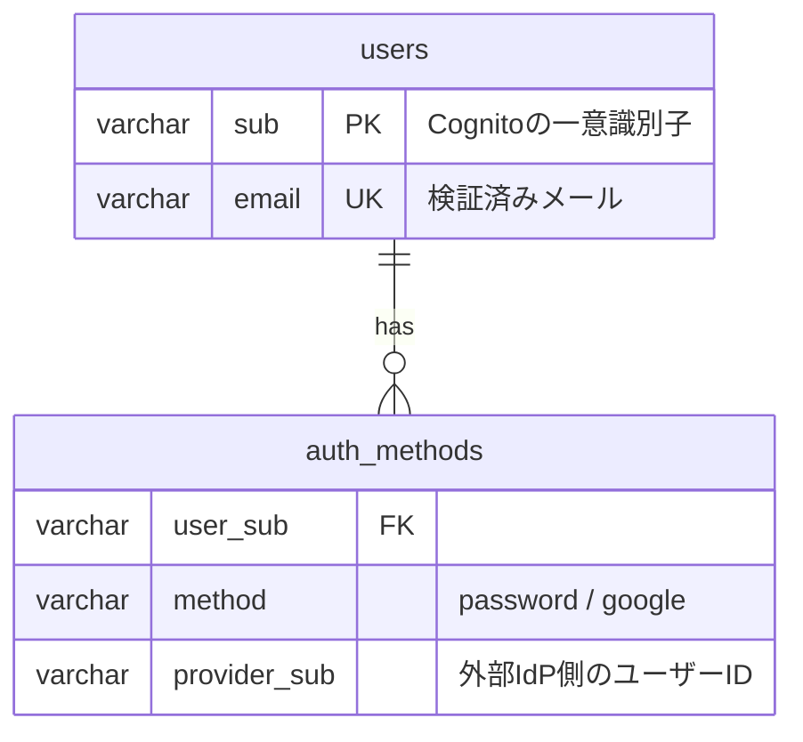
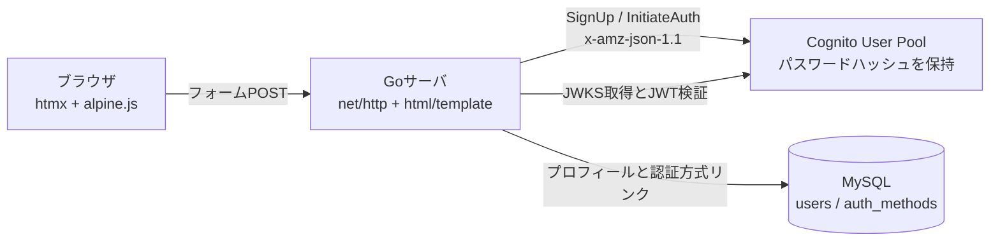

# cognito-login-sample

OAuth2.0で作成したアカウントに対して、後からメールアドレスとパスワードの入力欄でログインできるSaaSとできないSaaSが存在する理由を、AWS CognitoとGoの実装で実演するサンプルです。

## この実装が示すこと

### 挙動差の正体

OAuth2.0でSaaSのアカウントを作成した場合、SaaS側にはパスワードという認証情報がそもそも存在しません。Googleのパスワードは常にGoogleのドメイン上でのみ入力され、SaaSには一度も渡らないためです。それでもログイン画面の挙動がSaaSによって分かれるのは、アカウントと認証方式の保存設計が異なるためです。

| 挙動 | 保存されているもの | ログイン時の判定 |
| --- | --- | --- |
| ログインできるSaaS | ユーザーが別途ローカルパスワードを設定済み、またはメール入力時点でIdPへ振り分ける設計 | パスワード認証情報の照合、またはGoogleへのリダイレクトでGoogle側が検証する |
| ログインできないSaaS | OAuthのリンク（providerとprovider側のユーザーID）のみで、パスワード行が存在しない | パスワード認証情報のテーブルに該当行がないため拒否する |

ログインできないSaaSでも、メールアドレス自体は保存されています。パスワードという経路が存在しないだけです。

### データモデル

1 アカウントにN個の認証方式をリンクするモデルを採用しています。認証情報（パスワードハッシュ）はCognitoユーザープールが保持し、アプリ側のMySQLには一切保存しません。



ログイン処理はCognitoへ問い合わせる前にauth_methodsを確認し、Google連携のみのアカウントには「このアカウントはGoogleログインで作成されています」と案内してパスワード経路を遮断します。これがhome realm discoveryと呼ばれる方式の最小実装です。

### 採用しているベストプラクティス

- 認証失敗時はユーザーの存在有無を区別しない共通メッセージを返し、アカウント列挙を防ぎます。Cognito側でもprevent_user_existence_errorsを有効にしています
- 未検証メールでの自動リンクは行いません。攻撃者が先回りしてパスワード登録し、後から被害者のGoogleログインと合流させるアカウント乗っ取りを防ぐためです
- Google連携のみのメールアドレスは、ログインだけでなく新規登録の経路でも同じ案内で遮断します。登録からパスワード認証情報を生やせると経路の一貫性が崩れるためです
- セッションはCognitoのIDトークンをHttpOnly / SameSite=LaxのCookieに保持し、サーバ側で署名（RS256 / JWKS）とiss / aud / token_use / expを検証します
- 状態変更リクエストはnet/httpのCrossOriginProtectionで遮断し、認証エンドポイントにはIP単位のレートリミットを適用します

## アーキテクチャ



Goは標準ライブラリのみでCognito API（SignUp / ConfirmSignUp / InitiateAuth）を呼び出します。これらは署名不要の匿名APIのため、AWS SDKなしのHTTPS POSTで完結します。サードパーティ依存はMySQLドライバと、テスト用のtestcontainersだけです。

## セットアップ

### 1. Cognitoユーザープールの作成

```bash
cd terraform
terraform init
terraform apply
terraform output -raw client_secret
```

### 2. 環境変数の設定

```bash
cp .env.example .env
```

`.env` のCOGNITO_USER_POOL_ID / COGNITO_CLIENT_ID / COGNITO_CLIENT_SECRET をterraform outputの値で置き換えてください。

### 3. MySQLとサーバの起動

```bash
docker compose up -d
set -a && source .env && set +a
go run ./cmd/server
```

http://localhost:8080/signupで登録し、メールに届く確認コードを入力するとhttp://localhost:8080/loginからログインできます。ログイン後のページはJWT検証を通過した場合のみ表示されます。

### Google 連携のみのアカウントを再現する

Google federated IdPは本サンプルでは設定手順の提示までとし、実動させていません。挙動は次のシードでアプリDBにGoogle連携のみのユーザーを作ることで再現できます。

```sql
INSERT INTO users (sub, email) VALUES ('google-demo-sub', 'demo-google@example.com');
INSERT INTO auth_methods (user_sub, method, provider_sub)
VALUES ('google-demo-sub', 'google', 'google-oauth2|1234567890');
```

この状態でdemo-google@example.comと任意のパスワードでログインすると、パスワード照合ではなくGoogle経路への案内が返ります。

### Google 連携を実動させる場合の手順

1. Google Cloud ConsoleでOAuthクライアント（Web アプリケーション）を作成し、リダイレクトURIに `https://<cognito-domain>/oauth2/idpresponse` を登録します
2. Terraformにaws_cognito_identity_provider（provider_type = "Google"）とaws_cognito_user_pool_domainを追加します
3. アプリにHosted UIの `/oauth2/authorize` へのリダイレクトと `/oauth2/token` のコールバック処理を追加します
4. 同一メールのアカウント統合にはPreSignUp LambdaトリガーでAdminLinkProviderForUserを呼び、検証済みメールの場合のみリンクします
5. `.env` のGOOGLE_LOGIN_URLへHosted UIのauthorize URL（`https://<cognito-domain>/oauth2/authorize?identity_provider=Google&...`）を設定すると、ログイン画面のGoogleボタンがそこへ遷移します。未設定の間は未設定である旨の案内を表示します

## テスト

```bash
go test -race ./...
```

テストは次の方針で書いています。

- アサーションは戻り値と状態変化の中身まで検証し、エラーの有無だけの確認を合格にしません
- repository層はsqlmockではなくtestcontainersの実MySQLに対して検証し、スキーマ・制約・トランザクションのロールバックまで実挙動で確かめます
- CognitoクライアントはHTTP層のhttptestサーバで実APIと同形のリクエストとレスポンスを検査し、実装の思い込みがモックへ写ることを防ぎます
- JWT検証は期限切れ・発行者不一致・aud不一致・token_use不一致・alg=none・ペイロード改ざん・未知のkidを個別に拒否できることを確認します
- 共有状態（JWKSキャッシュ、レートリミッタ）は -race 付きの並行テストで検証します

## CI

GitHub Actionsはokamyuji/reusable-workflows@v1のgo-ci（vet / build / test -race）とsecurity-scan（gitleaks）を呼び出します。
