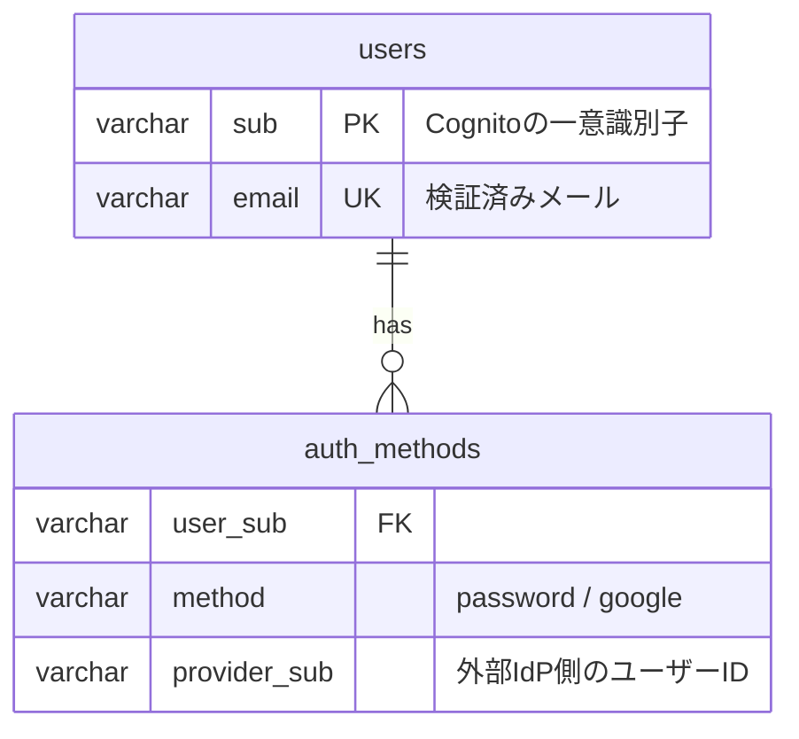
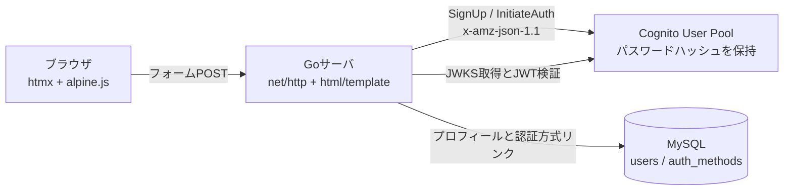

# cognito-login-sample

OAuth2.0 で作成したアカウントに対して、後からメールアドレスとパスワードの入力欄でログインできる SaaS とできない SaaS が存在する理由を、AWS Cognito と Go の実装で実演するサンプルです。

## この実装が示すこと

### 挙動差の正体

OAuth2.0 で SaaS のアカウントを作成した場合、SaaS 側にはパスワードという認証情報がそもそも存在しません。Google のパスワードは常に Google のドメイン上でのみ入力され、SaaS には一度も渡らないためです。それでもログイン画面の挙動が SaaS によって分かれるのは、アカウントと認証方式の保存設計が異なるためです。

| 挙動 | 保存されているもの | ログイン時の判定 |
| --- | --- | --- |
| ログインできる SaaS | ユーザーが別途ローカルパスワードを設定済み、またはメール入力時点で IdP へ振り分ける設計 | パスワード認証情報の照合、または Google へのリダイレクトで Google 側が検証する |
| ログインできない SaaS | OAuth のリンク（provider と provider 側のユーザー ID）のみで、パスワード行が存在しない | パスワード認証情報のテーブルに該当行がないため拒否する |

ログインできない SaaS でも、メールアドレス自体は保存されています。パスワードという経路が存在しないだけです。

### データモデル

1 アカウントに N 個の認証方式をリンクするモデルを採用しています。認証情報（パスワードハッシュ）は Cognito ユーザープールが保持し、アプリ側の MySQL には一切保存しません。



ログイン処理は Cognito へ問い合わせる前に auth_methods を確認し、Google 連携のみのアカウントには「このアカウントは Google ログインで作成されています」と案内してパスワード経路を遮断します。これが home realm discovery と呼ばれる方式の最小実装です。

### 採用しているベストプラクティス

- 認証失敗時はユーザーの存在有無を区別しない共通メッセージを返し、アカウント列挙を防ぎます。Cognito 側でも prevent_user_existence_errors を有効にしています
- 未検証メールでの自動リンクは行いません。攻撃者が先回りしてパスワード登録し、後から被害者の Google ログインと合流させるアカウント乗っ取りを防ぐためです
- セッションは Cognito の ID トークンを HttpOnly / SameSite=Lax の Cookie に保持し、サーバ側で署名（RS256 / JWKS）と iss / aud / token_use / exp を検証します
- 状態変更リクエストは net/http の CrossOriginProtection で遮断し、認証エンドポイントには IP 単位のレートリミットを適用します

## アーキテクチャ



Go は標準ライブラリのみで Cognito API（SignUp / ConfirmSignUp / InitiateAuth）を呼び出します。これらは署名不要の匿名 API のため、AWS SDK なしの HTTPS POST で完結します。サードパーティ依存は MySQL ドライバと、テスト用の testcontainers だけです。

## セットアップ

### 1. Cognito ユーザープールの作成

```bash
cd terraform
terraform init
terraform apply
terraform output -raw client_secret
```

### 2. 環境変数の設定

```bash
cp .env.example .env
```

`.env` の COGNITO_USER_POOL_ID / COGNITO_CLIENT_ID / COGNITO_CLIENT_SECRET を terraform output の値で置き換えてください。

### 3. MySQL とサーバの起動

```bash
docker compose up -d
set -a && source .env && set +a
go run ./cmd/server
```

http://localhost:8080/signup で登録し、メールに届く確認コードを入力すると http://localhost:8080/login からログインできます。ログイン後のページは JWT 検証を通過した場合のみ表示されます。

### Google 連携のみのアカウントを再現する

Google federated IdP は本サンプルでは設定手順の提示までとし、実動させていません。挙動は次のシードでアプリ DB に Google 連携のみのユーザーを作ることで再現できます。

```sql
INSERT INTO users (sub, email) VALUES ('google-demo-sub', 'demo-google@example.com');
INSERT INTO auth_methods (user_sub, method, provider_sub)
VALUES ('google-demo-sub', 'google', 'google-oauth2|1234567890');
```

この状態で demo-google@example.com と任意のパスワードでログインすると、パスワード照合ではなく Google 経路への案内が返ります。

### Google 連携を実動させる場合の手順

1. Google Cloud Console で OAuth クライアント（Web アプリケーション）を作成し、リダイレクト URI に `https://<cognito-domain>/oauth2/idpresponse` を登録します
2. Terraform に aws_cognito_identity_provider（provider_type = "Google"）と aws_cognito_user_pool_domain を追加します
3. アプリに Hosted UI の `/oauth2/authorize` へのリダイレクトと `/oauth2/token` のコールバック処理を追加します
4. 同一メールのアカウント統合には PreSignUp Lambda トリガーで AdminLinkProviderForUser を呼び、検証済みメールの場合のみリンクします

## テスト

```bash
go test -race ./...
```

テストは次の方針で書いています。

- アサーションは戻り値と状態変化の中身まで検証し、エラーの有無だけの確認を合格にしません
- repository 層は sqlmock ではなく testcontainers の実 MySQL に対して検証し、スキーマ・制約・トランザクションのロールバックまで実挙動で確かめます
- Cognito クライアントは HTTP 層の httptest サーバで実 API と同形のリクエストとレスポンスを検査し、実装の思い込みがモックへ写ることを防ぎます
- JWT 検証は期限切れ・発行者不一致・aud 不一致・token_use 不一致・alg=none・ペイロード改ざん・未知の kid を個別に拒否できることを確認します
- 共有状態（JWKS キャッシュ、レートリミッタ）は -race 付きの並行テストで検証します

## CI

GitHub Actions は okamyuji/reusable-workflows@v1 の go-ci（vet / build / test -race）と security-scan（gitleaks）を呼び出します。
